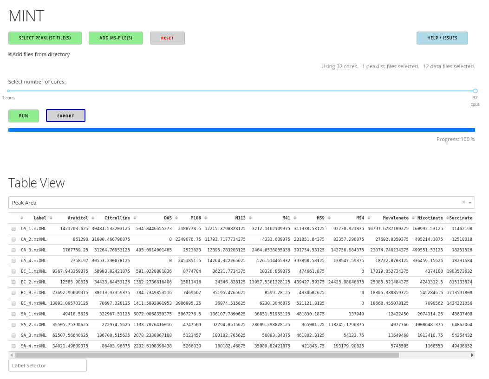

# MINT (Metabolomics Integrator)

The Metabolomics Integrator (MINT)) is a post-processing tool for liquid chromatography-mass spectrometry (LCMS) based metabolomics. 
Metabolomics is the study of all metabolites (small chemical compounds) in a biological sample e.g. from bacteria or a human blood sample. 
The metabolites can be used to define biomarkers used in medicine to find treatments for diseases or for the development of diagnostic tests 
or for the identification of pathogens such as methicillin resistant _Staphylococcus aureus_ (MRSA). More information on how to install and run the program can be found in the [Documentation](https://soerendip.github.io/ms-mint/).

## News

MINT is now available as a [Docker](https://www.docker.com/) container on DockerHub with a new [interface](https://github.com/soerendip/ms-mint-streamlit). Containers are a standardized unit of software that allows developers to isolate their application from its environment, solving the 'it works on my machine' headache. Every computer that runs docker can now run MINT as well. You can pull and run the latest image with:

    docker pull msmint/msmint:latest
    docker run -p 8501:8501 -it msmint/msmint:latest

Then navigate to http://localhost:8501.

## Download Latest release
For Windows 10 a build is provided [here](https://github.com/soerendip/ms-mint/releases/latest)

Simply, unpack the zip-archive and start `Mint.exe`. Then navigate to http://localhost:9999 if the browser does not open automatically.

## Installation

### Installation with pip

The program can be installed in a Python 3 (>= 3.7) environment using `pip`:

    pip install ms-mint

Then the GUI can be started with 

    Mint.py

Then navigate to http://localhost:9999 if the browser does not open automatically.

### From source and creating windows executable

    git clone ...
    pip install -e . 
    pyinstaller --one-dir specfiles\Mint__onedir__.spec
