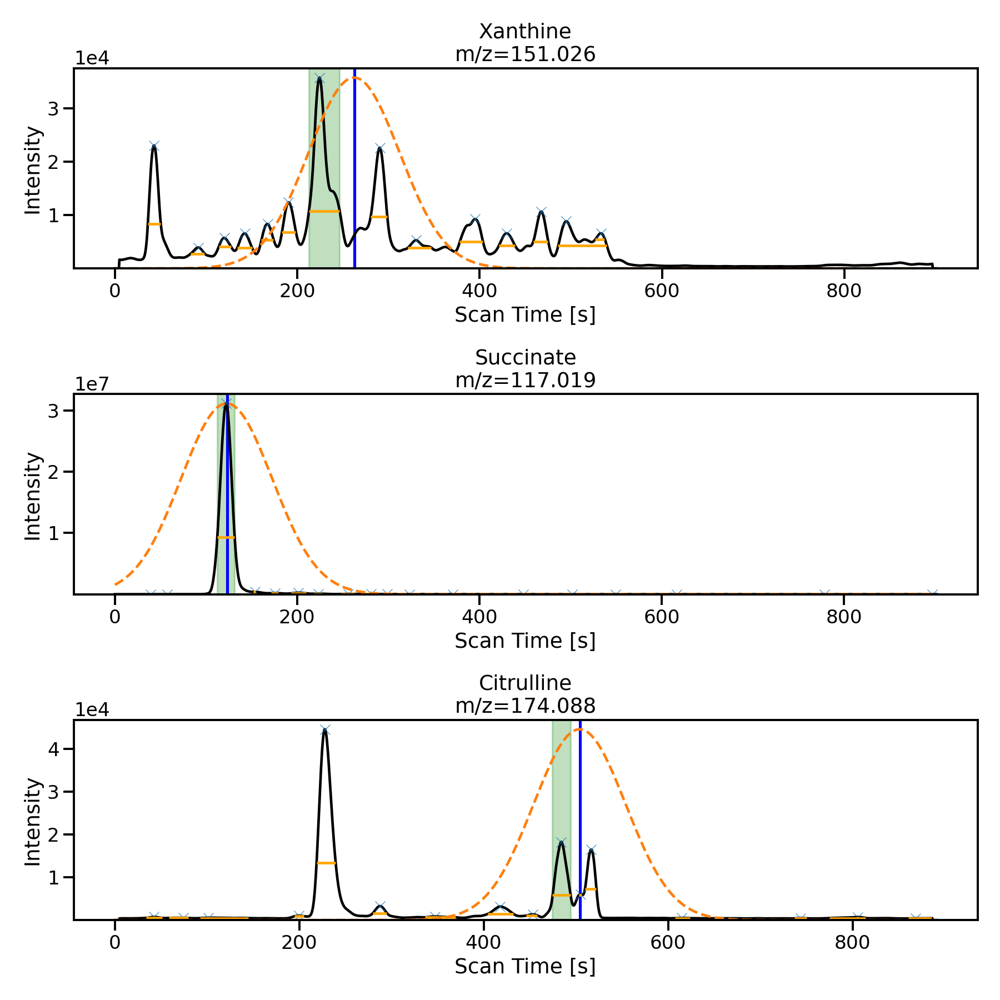
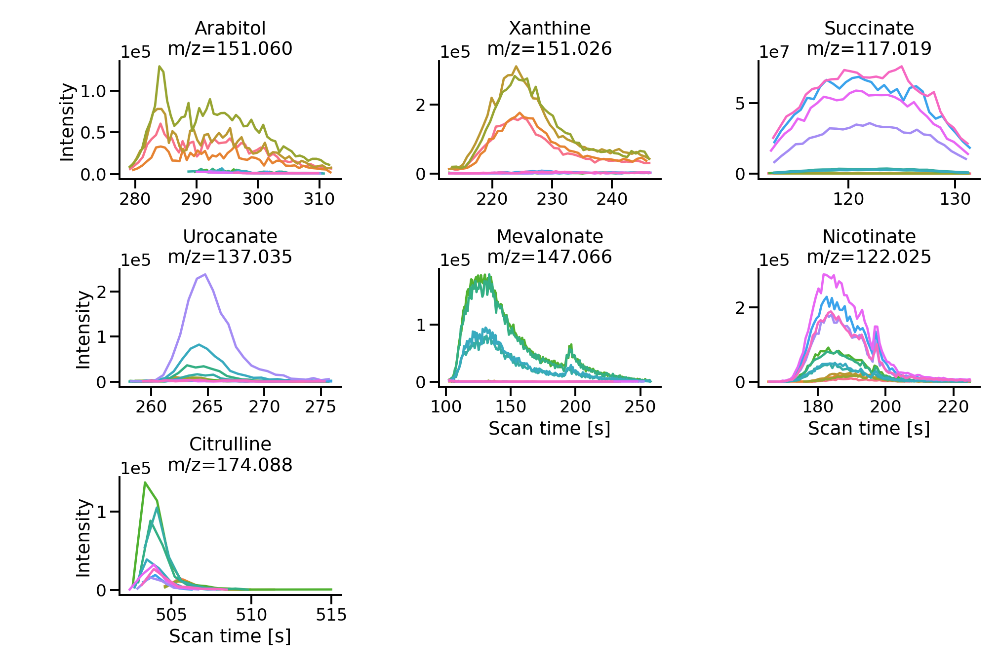
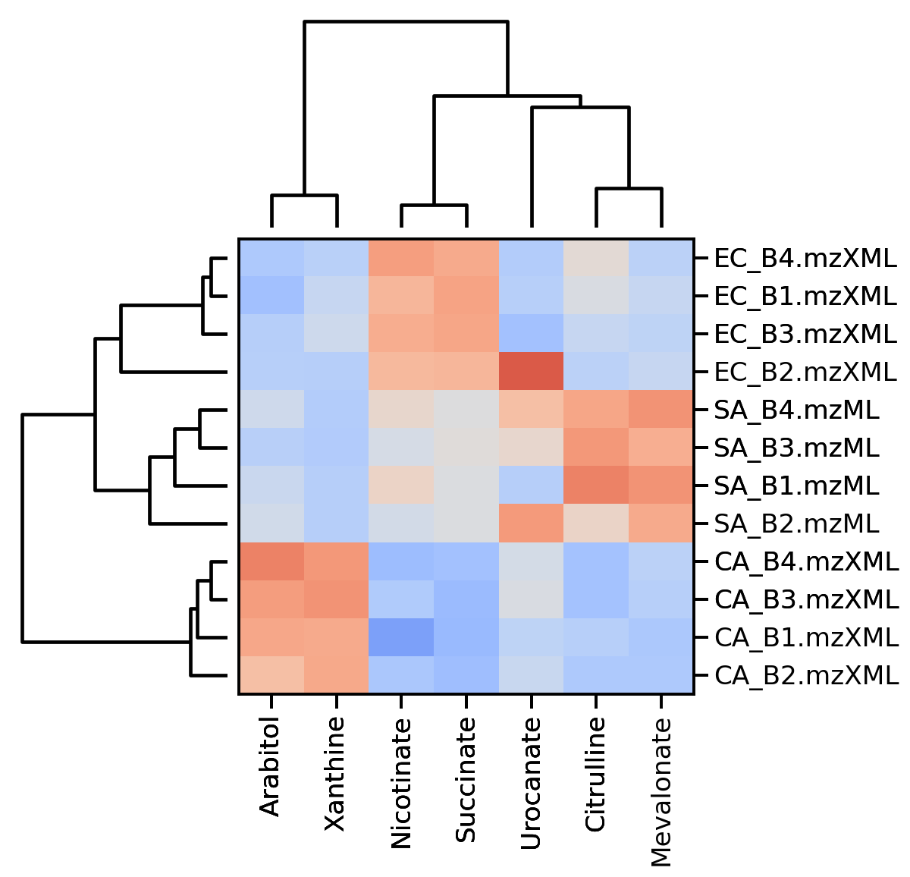
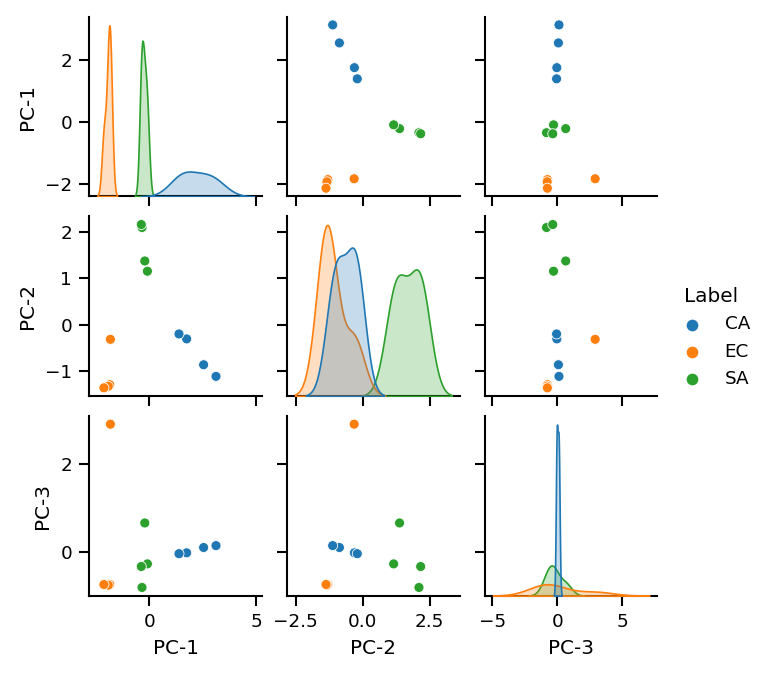

# Wecome to ms-mint 

## A Python library for targeted metabolomics
The `ms-mint` library can be used for targeted metabolomics and large amounts of files (1000+). Metabolomics is the study of all small chemical compounds (metabolites) in a biological sample. 
The metabolites can define biomarkers, which are used in medicine as indicators of disease or for the development of diagnostic tests. `ms-mint` contains functions to process liquid chromatography-mass spectrometry (LCMS) based metabolomics data in various formats. It uses a target list and the MS-filenames as input to extract peak intensities and other information. 

## Documentation
The code documentation can be accessed [here](https://lewisresearchgroup.github.io/ms-mint/modules.html).

## News
MINT has been split into the Python library and the app. This repository contains the Python library. For the app follow [this link](https://github.com/LewisResearchGroup/ms-mint-app).

## Contributions
All contributions, bug reports, code reviews, bug fixes, documentation improvements, enhancements, and ideas are welcome.
Before you modify the code please reach out to us using the [issues](https://github.com/LewisResearchGroup/ms-mint/issues) page.

## Code standards
The project follows PEP8 standard and uses Black and Flake8 to ensure a consistent code format throughout the project.

## Example usage

    %pylab inline
    from ms_mint.notebook import Mint
    mint = Mint()

    mint.ms_files = [
        './input/EC_B2.mzXML',
        './input/EC_B1.mzXML',
        './input/CA_B1.mzXML',
        './input/CA_B4.mzXML',
        './input/CA_B2.mzXML',
        './input/CA_B3.mzXML',
        './input/EC_B4.mzXML',
        './input/EC_B3.mzXML',
        './input/SA_B4.mzML',
        './input/SA_B2.mzML',
        './input/SA_B1.mzML',
        './input/SA_B3.mzML'
    ]

To load the target definitions from a file the `load_targets` method is used:    
    
    mint.load_targets('targets.csv')
    
    mint.targets
    >>>    peak_label    mz_mean  mz_width       rt  rt_min  rt_max  intensity_threshold target_filename
        0    Arabitol  151.06050        10  4.92500    4.65    5.20                    0     targets.csv
        1    Xanthine  151.02585        10  4.37265    4.18    4.53                    0     targets.csv
        2   Succinate  117.01905        10  2.04390    0.87    2.50                    0     targets.csv
        3   Urocanate  137.03540        10  4.41500    4.30    4.60                    0     targets.csv
        4  Mevalonate  147.06570        10  3.00000    1.70    4.30                    0     targets.csv
        5  Nicotinate  122.02455        10  3.05340    2.75    3.75                    0     targets.csv
        6  Citrulline  174.08810        10  8.40070    8.35    8.50                    0     targets.csv

When filenames and targets are loaded, the processing can be started by calling the `run()` method:

    mint.run()  # Use mint.run(output_fn='results') for many files to prevent memory issues.

Then the results will be stored in the `results` attribute:
    mint.results
    >>>
    ...

# Plotting and data exploration

The `Mint` class has a few convenient methods to visualize and explore the processed data.

## Plot peak shapes

    mint.plot.peak_shapes(col_wrap = 3)

## Optimize retention times

    mint.opt.find_rt_min_max(
        peak_labels=['Xanthine', 'Succinate', 'Citrulline'], 
        plot=True, rel_height=0.7, sigma=50, col_wrap=1, aspect=3,
        height=4
    )
    

    mint.run()

## Hierarchical clustering

    mint.plot.hierarchical_clustering()

## Principal Components Analysis

    mint.pca.run(5)
    mint.pca.plot.pairplot(5)
    

# FAQ
## What is a target list
A target list is a pandas dataframe with specific columns. 

-   **peak_label**: str, Label of the peak (must be unique).
-   **mz_mean**: float, m/z value of the target ion.
-   **mz_width**: float, width of the peak in [ppm] of the `mz_mean` value.
-   **rt**: float (optional), expected time of the peak maximum.
-   **rt_min**: float, starting time for peak integration.
-   **rt_max**: float, ending time for peak integration.
-   **intensity_threshold**: float (>=0), minimum intensity value to include, serves as a noise filter.
-   **target_filename**: str (optional), name of the target list file.

The target list can be stored as csv or Excel file. 

## What input files can be used
`ms_mint` can be used with `mzXML`, `mzML`, `mzMLb` and experimental formats in `.feather` and `.parquet` format.

## Which properties does ms-mint extract
### Parameters from target list
-   **ms_file**: Filename of MS-file
-   **peak_label**: From target list
-   **mz_mean**: From target list
-   **mz_width**: From target list
-   **rt**: From target list
-   **rt_min**: From target list
-   **rt_max**: From target list
-   **rt_unit**: Unit of retention times, default is s (seconds), from [s, min]
-   **intensity_threshold**: From target list
-   **target_filename**: From target list

---

### Results columns
-   **peak_area**: The sum of all intensities
-   **peak_area_top3**: The sum of the 3 largest intensities
-   **peak_n_datapoints**: Number of datapoints
-   **peak_max**: Intensity of peak maximum
-   **peak_rt_of_max**: Retentiontime of peak maximum
-   **peak_min**: Minimm peak intensity (offset)
-   **peak_median**: Median of all intensities 
-   **peak_mean**: Average of all intensities
-   **peak_delta_int**: Difference between first and last intensity
-   **peak_shape_rt**: Array of retention times
-   **peak_shape_int**: Array of projected intensities
-   **peak_mass_diff_25pc**: 25th percentile between *mz_mean* minus m/z values of all datapoints
-   **peak_mass_diff_50pc**: Median between *mz_mean* minus m/z values of all datapoints
-   **peak_mass_diff_75pc**: 75th percentile between *mz_mean* minus m/z values of all datapoints
-   **peak_score**: Score of peak quality (experimental)
-   **total_intensity**: Sum of all intensities in the file
-   **ms_path**: Path of the MS-file
-   **ms_file_size**: Size of the MS-file in MB
---
