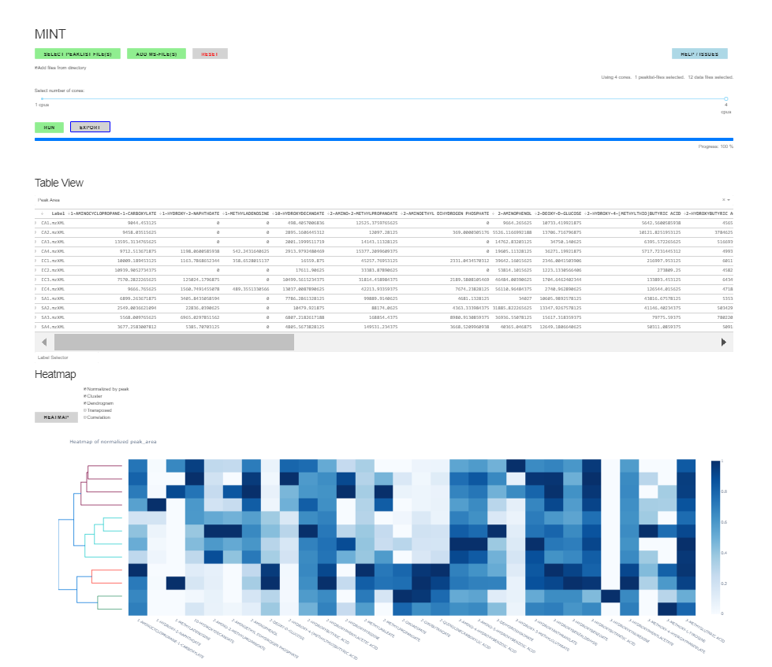
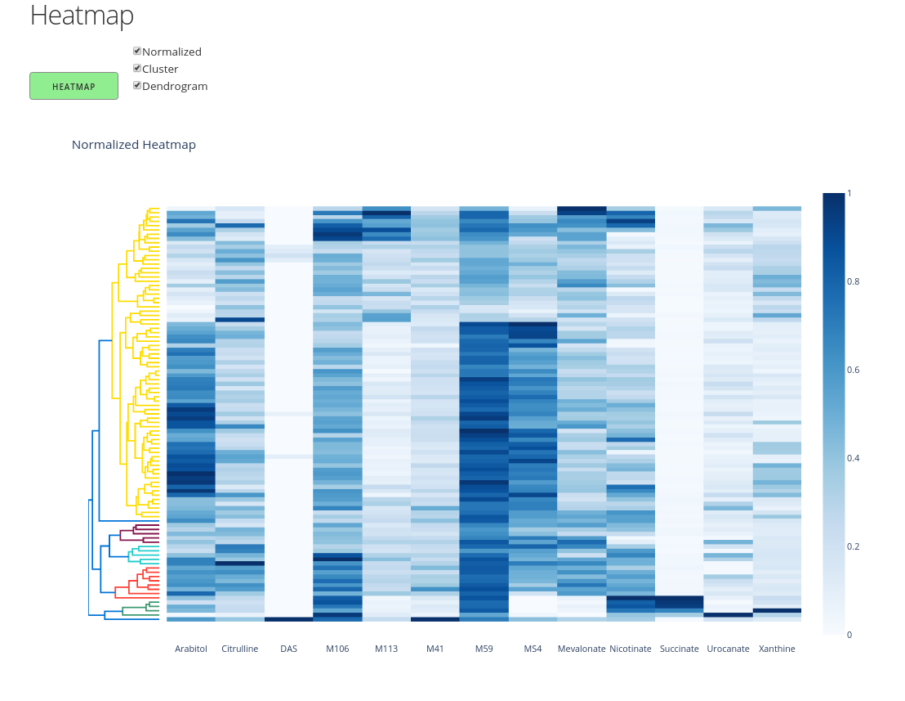
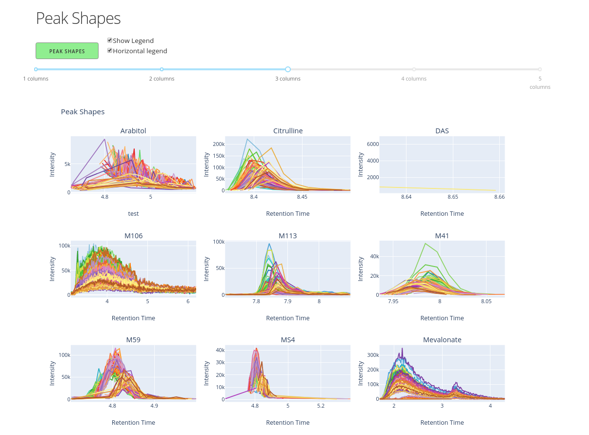
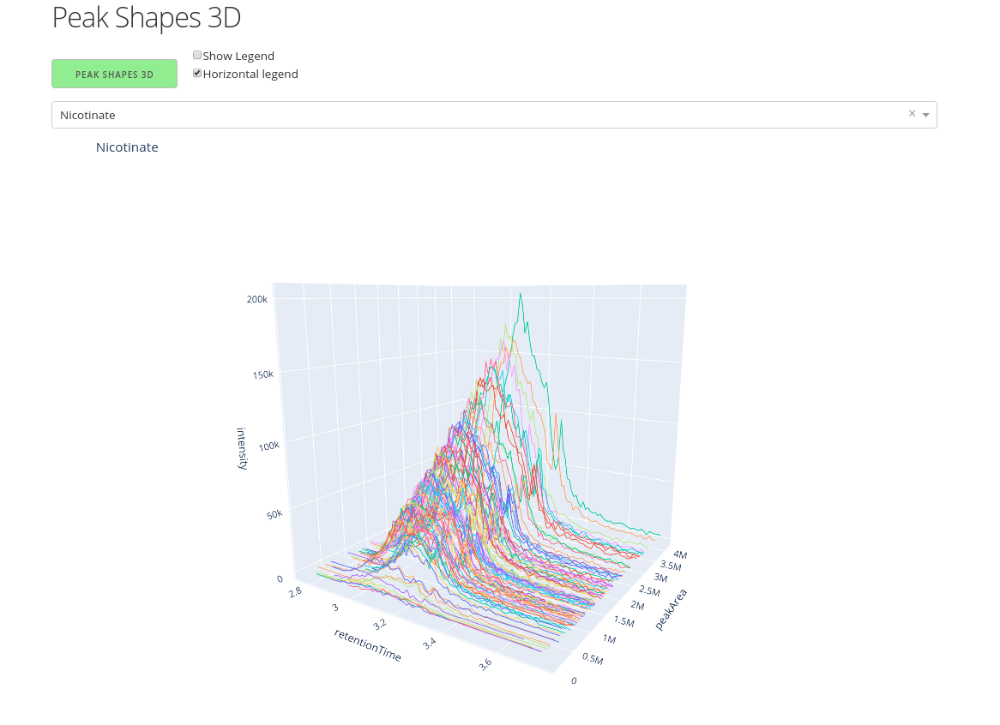

# Metabolomics Integrator (MINT)

An app for summing up intensity values in mass spectrometry mzXML files in specified windows of retention time and m/z values.

## Installation

Here we use `conda` from the [miniconda](https://conda.io/en/latest/miniconda.html) 
(or alternatively `anaconda`) package to install dependencies in a virtual environment.

    git clone https://github.com/soerendip/ms-mint
    cd ms-mint

    conda create -n ms-mint -c plotly lxml matplotlib pandas pandoc pip plotly plotly_express dash dash-bootstrap-components pyqt python=3 scipy setuptools sqlite statsmodels flask

    conda activate ms-mint
    pip install pyteomics openpyxl colorlover
    python setup.py install  # Don't use pip to install it.

## Start the application

Start the app with

    conda activate ms-mint
    Mint.py  # Under Linux
    python scripts/Mint.py  # Under Windows

Then navigate to the following ULR with your browser:

    http://localhost:9999/apps/Mint.ipynb?appmode_scroll=0

# A typical workflow

