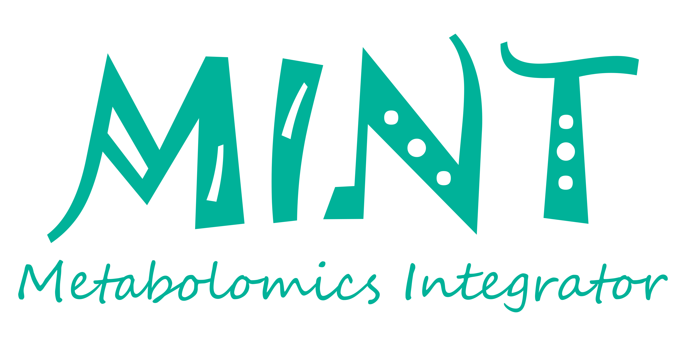
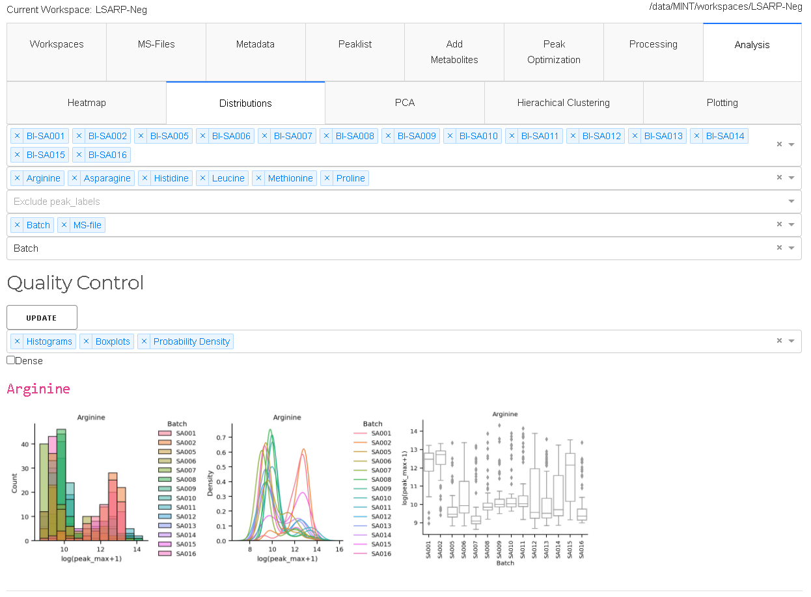
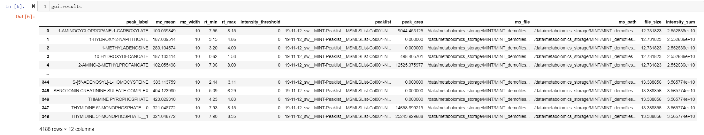

# MINT (Metabolomics Integrator)

The Metabolomics Integrator (MINT)) is a post-processing tool for liquid chromatography-mass spectrometry (LCMS) based metabolomics. 
Metabolomics is the study of all metabolites (small chemical compounds) in a biological sample e.g. from bacteria or a human blood sample. 
The metabolites can be used to define biomarkers used in medicine to find treatments for diseases or for the development of diagnostic tests 
or for the identification of pathogens such as methicillin resistant _Staphylococcus aureus_ (MRSA). 
More information on how to install and run the program can be found in the [Documentation](https://sorenwacker.github.io/ms-mint/).

# Metabolomics with Python

    from ms_mint.notebook import Mint
    mint.ms_files = glob('/path/to/files/*mzML')
    mint.peaklist_files = '/path/to/peaklist/file/peaklist.csv'
    mint.run()
    mint.results

More information in the documentation.

# Contributions are welcome
MINT integrates open-source software and packages into a Python library for metabolomics with a browser based GUI. It is programmed by scientists for scientists to contribute to  better and faster science integrating best practices of data management and computer science. Contributions are welcome that improve the efficiency of the code, bug fixes, feature implementations, security enhancements among others. If you want to contribute to MINT please send me a notification.

### How to contribute

#### Errors, Feedback, Feature Requests
If you encounter an error, if you have a request for a new feature, or for general feedback, please open a new ticket at the [issue tracker](https://github.com/sorenwacker/ms-mint/issues).

#### Code contributions
If your are up to enhance the codebase yourself, we ask you to followowing steps:

1. fork the repository
1. implement the new feature or bug-fix
1. add corresponding tests
2. run `flake8`
3. submit a pull request

#### Code standards
Before submitting a pull request please run `flake8`.

# Acknowledgements
This project would not be possible without the help of the open-source community. 
The tools and resources provided by GitHub, Docker-Hub, the Python Package Index, as well the answers from dedicated users on [Stackoverflow](stackoverflow.com)
and the [Plotly community](https://community.plotly.com/), as well as the free open-source packages used are the foundation of this project.
Several people have made direct contributions to the codebase and we are extremely grateful for that. 

- @rokm refactored the specfile for `Pyinstaller` to create a windows package. 
- @bucknerns helped with the configuration of the `versioneer` file.

Last but not least, we want to thank all the users and early adopters that drive the development with feature requests and bug reports.

