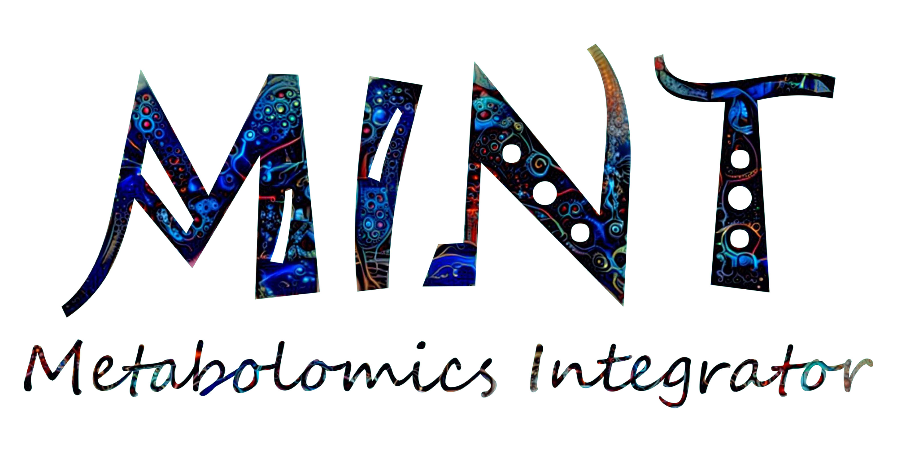

# MINT (Metabolomics Integrator)

The Metabolomics Integrator (MINT) is a post-processing tool for liquid chromatography-mass spectrometry (LCMS) based metabolomics. 
Metabolomics is the study of all metabolites (small chemical compounds) in a biological sample e.g. from bacteria or a human blood sample. 
The metabolites can be used to define biomarkers used in medicine to find treatments for diseases or for the development of diagnostic tests 
or for the identification of pathogens such as methicillin resistant _Staphylococcus aureus_ (MRSA). 
More information on how to install and run the program can be found in the [Documentation](https://sorenwacker.github.io/ms-mint/) or check out the 
[Quickstart](https:///sorenwacker.github.io/ms-mint/quickstart/) to jump right into it.

# News

MINT has been split into the Python library and the app. This repository contains the Python library. For the app follow [this link](https://github.com/LewisResearchGroup/ms-mint-app).