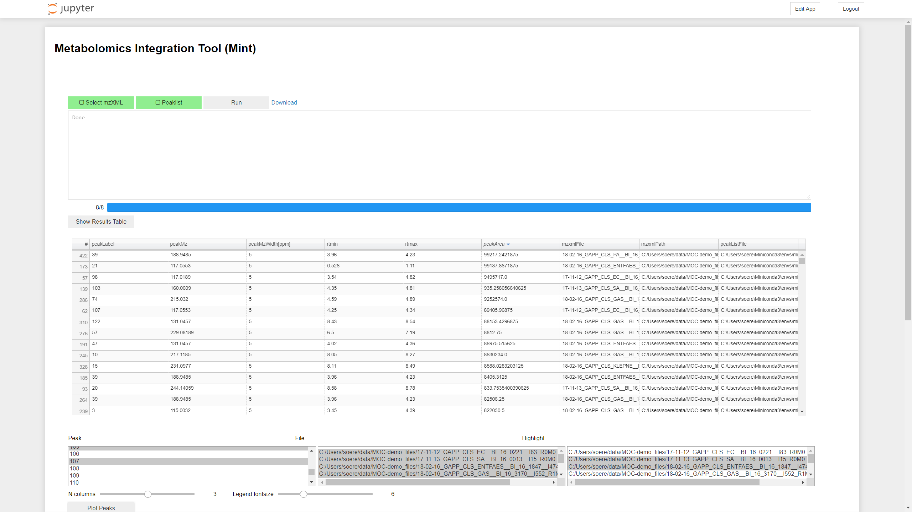

# Metabolomics Integration Tool (Mint)

A jupyter notebook based app for summing up intensity values in mass spectrometry mzXML files in specified windows of retention time and m/z.

## Installation

Here we use `conda` from the [miniconda](https://conda.io/en/latest/miniconda.html) 
(or alternatively `anaconda`) package to install dependencies in a virtual environment.

    git clone https://github.com/LSARP/mint
    cd mint
    conda env create -f environment.yml
    conda activate mint
    python setup.py install

## Start the application

Start the app with

    conda activate mint
    Mint  # Under Linux
    python scripts/Mint  # Under Windows

Then navigate to the following ULR with your browser:

    http://localhost:9999/apps/Mint.ipynb?appmode_scroll=0

