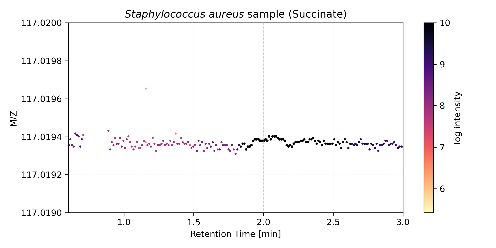
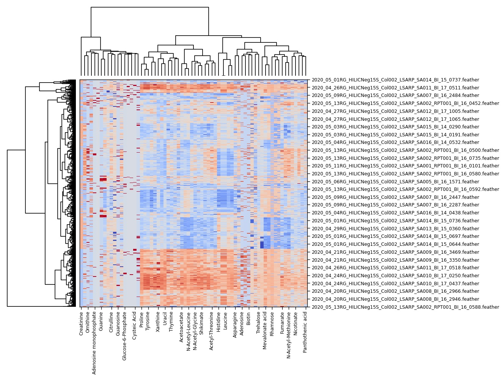

# Background

## What is LCMS?
A typical biological sample, such as human blood or agar with some kind of bacteria, can contain thousands of [metabolites](https://en.wikipedia.org/wiki/Metabolite) such as sugars, alcohols, amino acids, nucleotides and more. To meassure the composition of such a sample [mass spectrometry](https://en.wikipedia.org/wiki/Mass_spectrometry) can be used. 

However, many metabolites share exact masses with other metabolites and therefore would be undistiguishable in the mass spectrometer. 
Therefore, compounds are sorted using [column chromatography](https://en.wikipedia.org/wiki/Column_chromatography) and spread out over time.
The metabolites that enter the column at the same time interact with the column in different ways based on their specific stereochemistry. 
These interactions let compounds move faster or slower through the column and therefore the compounds will elude at different times.
That way various metabolites can be analysed successively over certain timeframe rather than simultaneously.

The mass spectrometer that follows the chromatographic column meassures the masses given at each point in time and returns a time dependent spectrogram.
An example of a LSMS meassurement is visualized in the following figure:

 
_**Figure 1:**_ A 2D-histogram of a MS1 recorded intensities taken over time span of 10 minutes. Shown are m/z values between 100 and 600 [Da/z].

If we zoom into this figure to a very narrow band of masses the traces of individual metabolites can be observed. The
trace of succinate (or [succinic acid](https://en.wikipedia.org/wiki/Succinic_acid)) is shown here: 

 
_**Figure 2:**_ A zoom into the 2D histogram shown in figure 1. 

This illustrates how dense and precise the information in a LCMS messurement is. For comparison the M/Z value of an electron is 5.489e-4.

## Processing LCMS data
After the data has been collected on a mass spectrometer (MS) and stored in a (usually) vendor specific format the data can be subjected to analysis.
To process data with MINT the data has to be provided in an open format (mzML or mzXML).

Instead of analysing the raw LCMS data it is common practise to deconvolute the data and sum up the signal of individual metabolites.
The processed data should be proportional to the amount of metabolite in the sample. 
However, the meassured intensities will not reflect the relative concentrations between different compounds, only between different samples.
For example, due to different ion efficiences compound **A** might have a stronger signal than compound **B** even if the
compound **B** is present at higher concentration. Therefore, the intensities can only be use to compare relative amounts. 
To estimate absolute concentrations a calibration curve has to be created for every single metabolite.

The binning transforms the semi-structured data into a structured format where each column stands for one particular metabolite.
Often the data is normalized for each metabolite to reflect the relative intensities across multiple samples. 
The structured data can then be subjected to common data anayses such as dimensionality reduction, or clustering analysis.

 
_**Figure 3:**_ Clustering analysis for a small set of metabolites across 12 different samples including 3 different pathogens (EC: _E. coli_, SA: _S. aureus_, CA: _C. albicans_).
