# Graphical User Interface

After [installation](install.md) MINT can be started by running `Mint.py`.

```console
Mint.py --help
usage: Mint.py [-h] [--no-browser] [--version] [--data-dir DATA_DIR] [--debug] [--port PORT] [--serve-path SERVE_PATH]

MINT frontend.

optional arguments:
  -h, --help            show this help message and exit
  --no-browser          do not start the browser
  --version             print current version
  --data-dir            target directory for MINT data
  --debug               start MINT server in debug mode
  --port                change the port
  --serve-path          serve app at a different path e.g. '/mint/' to serve the app at 'localhost:9999/mint/'
```

If the browser does not open automatically open it manually and navigate to `http://localhost:9999`. The app's frontend is build using [Plotly-Dash](https://plot.ly/dash/) and runs locally in a browser. Thought, the Python functions provided can be imported and used in any Python project independently. The GUI is under active development and may be optimized in the future.


## Workspaces

  - Add new workspaces
  - Delete workspaces
  - Activate workspace 

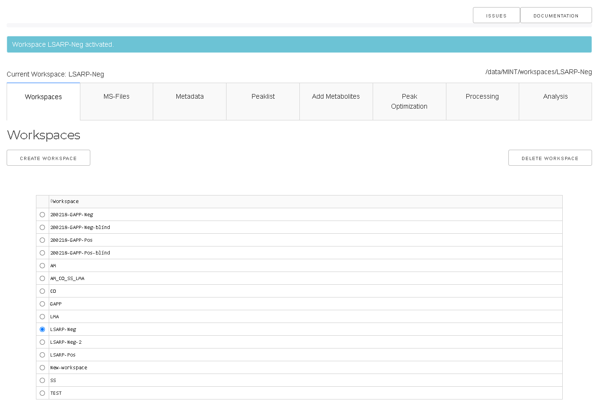

A workspace is a container for project files that is separated from other workspaces. Through workspaces it is possible to work on different projects simultaneously. 
All files relevant for one workspace are stored in a corresponding sub-folder of `--data-dir`, which by default is the folder MINT in the users home directory. 
The home directory is different on different platforms. Under Windows the default folder is: `C:/Users/<username>/MINT`. 
The path to the active workspace is always displayed above the workspace tab.

To activate a particular workspace the workspace has to be selected in the table and then the `ACTIVATE` button has to be clicked. 
`DELETE` will display a popup window upon confirmation the selected workspace with all corresponding files on the harddrive in `--data-dir` will be removed. 


## MS-files

  - Import mass spectrometry files (MS-file) in mzXML or mzML format
  - Convert file to feather format (other formats will be removed)
  - Remove MS-files from workspace

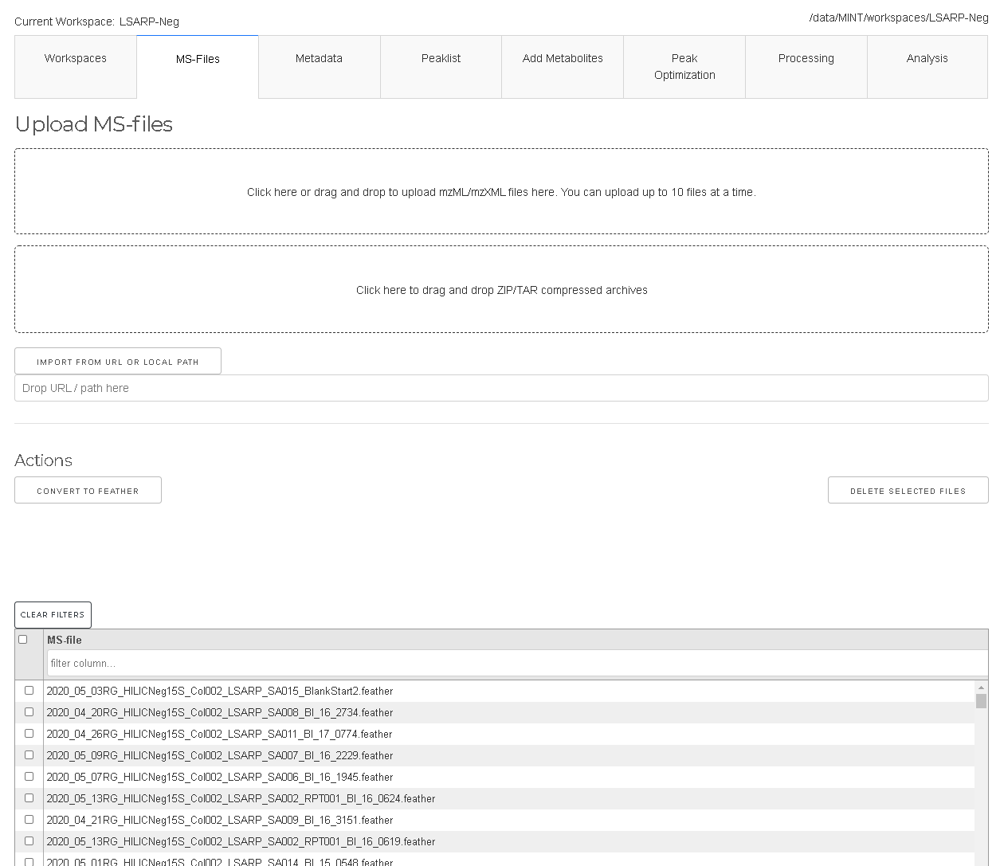

Mass-Spec files (in _mzML_ or _mzXML_ format) can be added under the `MS-files` tab by drag and drop or by using the selection form. 
Due to limitations of the Plotly-Dash framework only up to 10 files can be uploaded at a time. For larger projects, the files can simply 
be copied manually into the ms-files subdirectory. This will be improved in future versions of MINT. 

To remove certain files the files have to be selected in the table and the `DELETE SELECTED FILES` has to be clicked.

The files are converted to `feather` format which is based on Apache Arrow. It is a representation that allows faster read into memory.
If files were added manually by copying into the ms-files subdirectory the files can be converted to feather format with the `CONVERT TO FEATHER` button.
Note that _mzXML_ and _mzML_ files will be deleted after convertion. 


## Metadata
- Select samples used for peak optimization by setting values in the column `PeakOpt` to `True`.
- Add batch labels to analyse for possible batch effects.
- Add labels to analyse for differences of different groups (e.g. treatment and control)
- Add types for different files e.g. biological sample, quality control sample, standards etc in order to include ore exclude certain types during analysis.
- Add other types of metadata. 

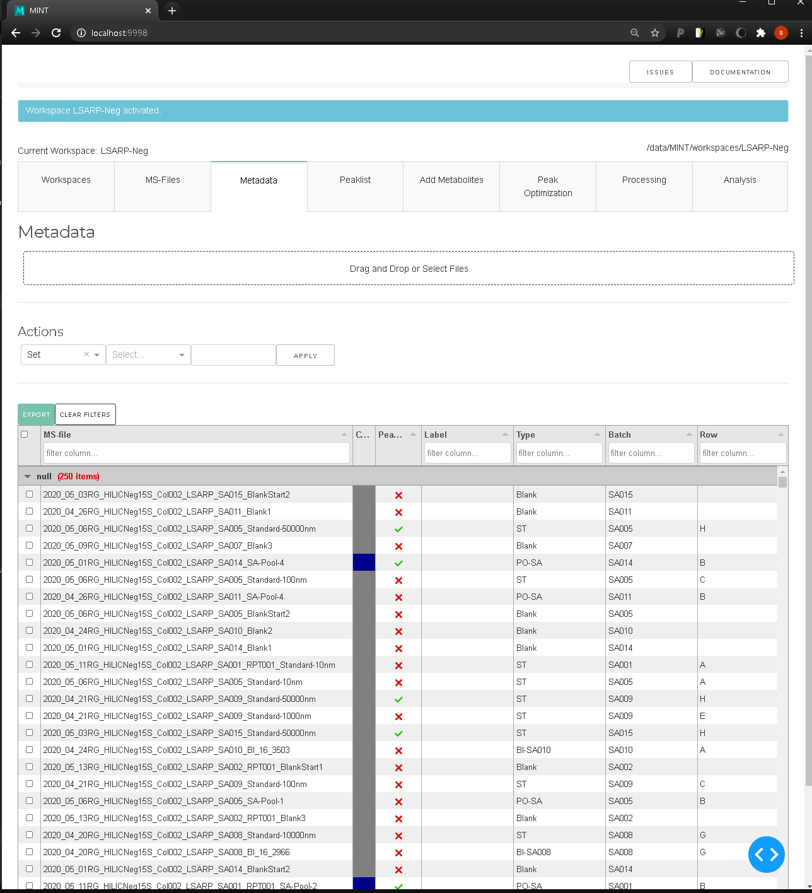

Metadata for the individual files can be edited in the `Metadata` tab. This data can be used to group results e.g. by batch or by label as well as types.
You want to edit metadata table to:

## Peaklist

- Import peaklist from CSV file or add new peaks manually
- Rename peaks definitions or change parameters
- Delete peak definitions

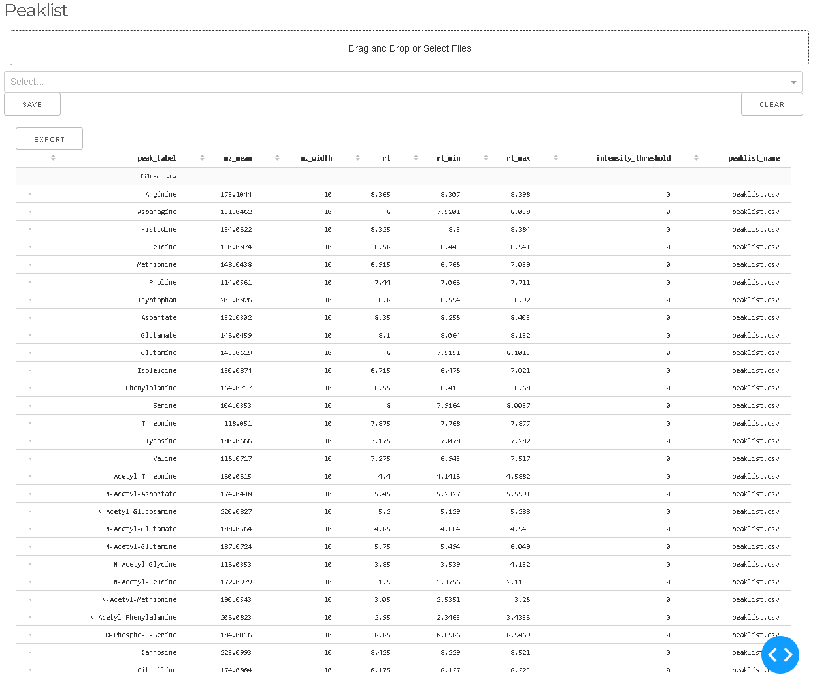

Peaklists are collection of peak definitions for the extraction of MS intensities beloning to individual metabolites. 
Peaklists can be provided as Excel or CSV files. Peaklists are explained in more detail [here](peaklists.md).
Files can be uploaded via the drag and drop area or the selection tool. The peaklist can be edited in place or
with the peak optimization tools.

## Add Metabolites

- Search for metabolites from ChEBI three stars database
- Add selected metabolites to peaklist (without RT estimation)

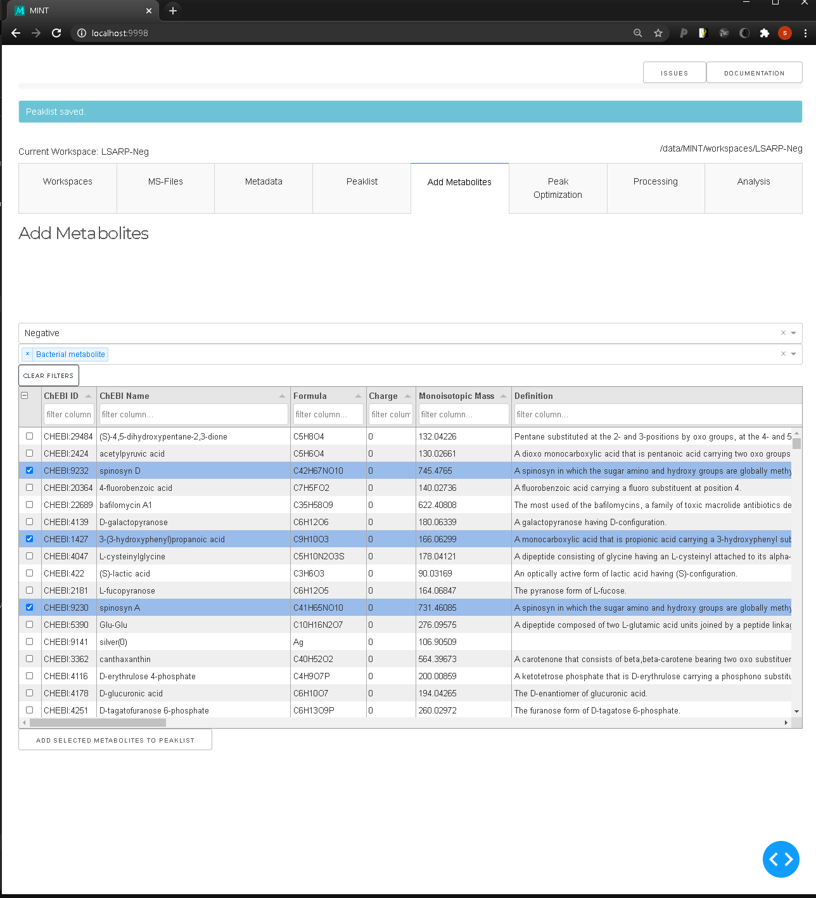


## Peak Optimization

 - Optimize retention times for all peaks or individual peaks
 - Preview all peakshapes with quality indicator

Retention times (RT) depend on the experiment and the specific chromatographic column used. 
Additionally, aging of the column leads to drifts in RT that have to be accounted for. 
The tools in the peak optimization tab can be used to quickly review all  peak definitions in 
the presently loaded peaklist. 

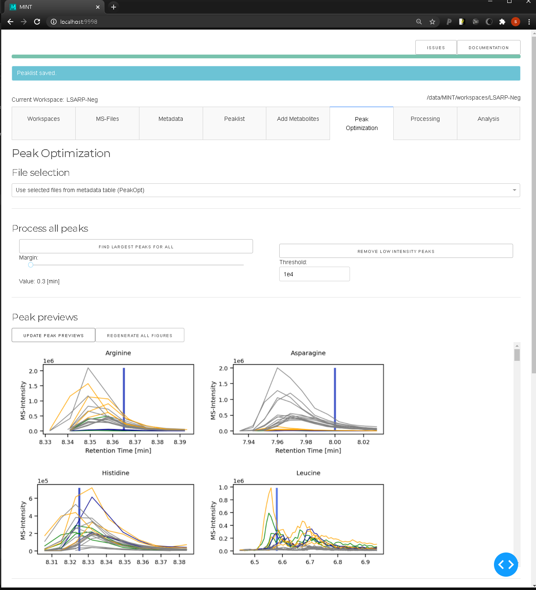


The `GENERATE PEAK PREVIEWS` generates a preview of all peak definitions and plots the
coresponding chromatograms for all files. The peaks can be reviewed and modified one by one
with the interactive tool. `FIND CLOSED PEAKS` iterates through all peak definitions and
identifes the closest peak with respect to the expected RT which is displayed as black vertical line.

### Manual (interactive) peak optimization

  - Optimize individual peaks one by one
  - Find bad peaks
  - Remove peaks from peaklist
  - Set expected retention time


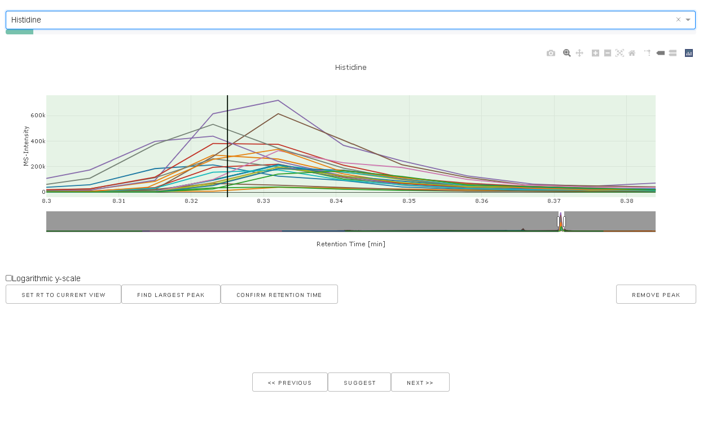

When a peak is selected in the drop down box the chromatograms for the particular mass windows
using the peak width as defined in the peaklist is extracted and displayed. The current rt window
is visualized as green box. `SET RT TO CURRENT VIEW` will set the *rt_min* and *rt_max* values 
to the current view and updated the peaklist accordingly.

## Processing

  - Run MINT (apply the extraction protocol to all files in the workspace)
  - Download results
  - Reset results and start again

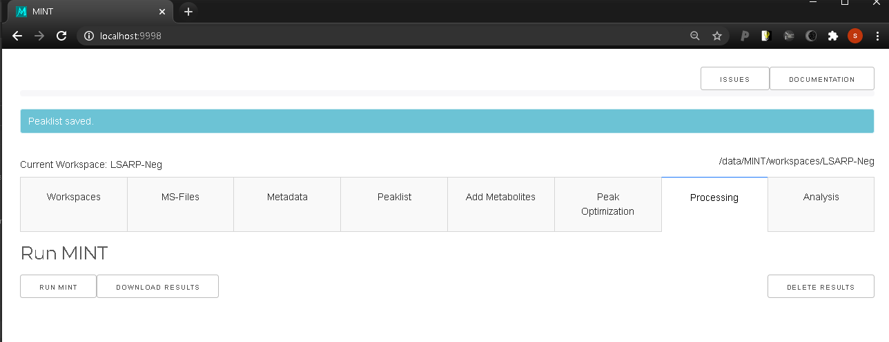


When all peaks look good the data can be processed using `RUN MINT`. This will apply
the current peaklist to the MS-files in the workspace and extract additional properties.
When the results tables are present the results can be explored with the following tabs. 
The generated results can be downloaded with the `DOWNLOAD` button.


## Analysis

After running MINT the results can be downloaed or analysed using the provided tools.
For quality control purposes histograms and boxplots can be generated in the 
quality control tab. 


### General selection elements


### Heatmap
The interactive heatmap tool can be used to explore the results data after `RUN MINT`
has been exectuted. The tool allows to explore the generated data in from of heatmaps.

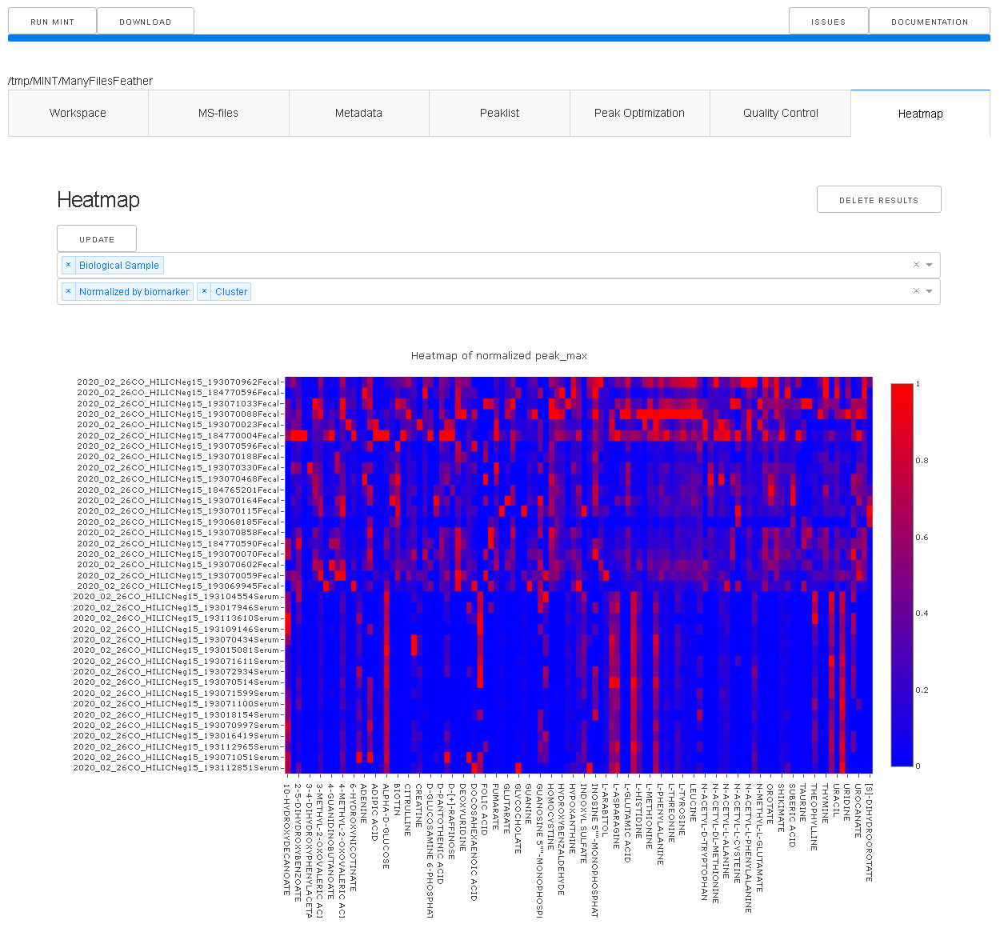

The first dropdown menu allows to include certain file types e.g. biological samples rather than quality control samples.
The second dropdown menu distinguishes the how the heatmap is generated. 

- Normalized by biomarer:
- Cluster: Cluster rows with hierachical clustering.  
- Dendrogram: Plots a dendrogram instead of row labels.
- Transpose: Switch columns and rows.
- Correlation: Calculate pearson correlation between columns.
- Show in new tab: The figure will be generated in a new independent tab. That way multiple heatmaps can be generated at the same time.

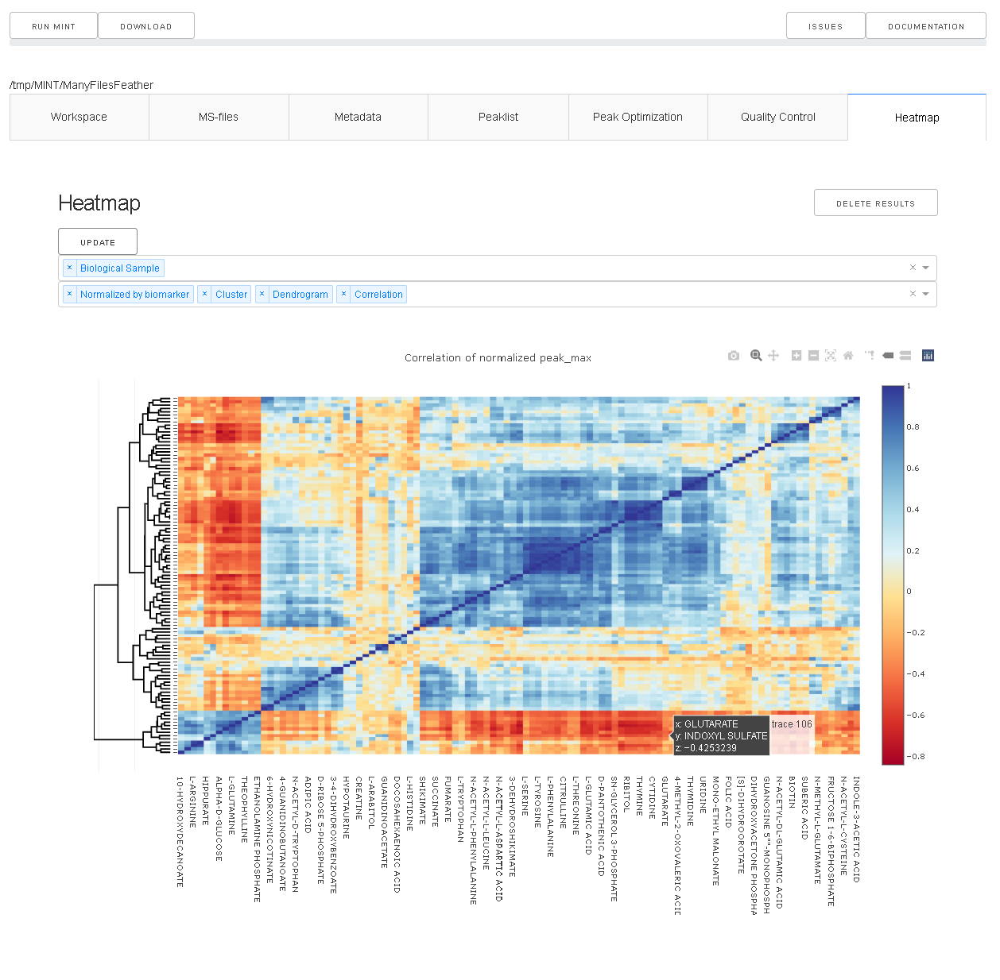


### Distributions

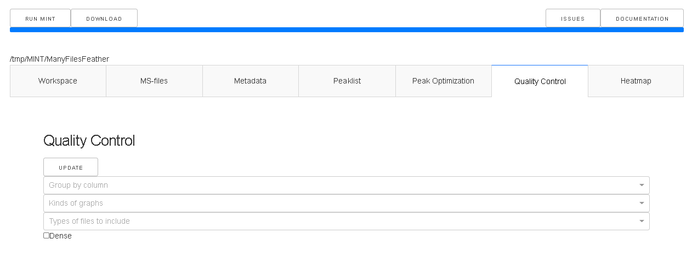

The MS-files can be grouped based on the values in the metadata table. If nothing
is selected the data will not be grouped in order to plot the overall distribution.
The second dropdown menu allows to select one or multple kinds of graphs that 
to generate. The third dropdown menu allows to include certain file types. 
For example, the analysis can be limited to only the biological samples if such a 
type has been defined in the type column of the metadata table. 

The checkbox can be used to create a dense view. If the box is unchecked the output will be
visually grouped into an individual section for each metabolite.


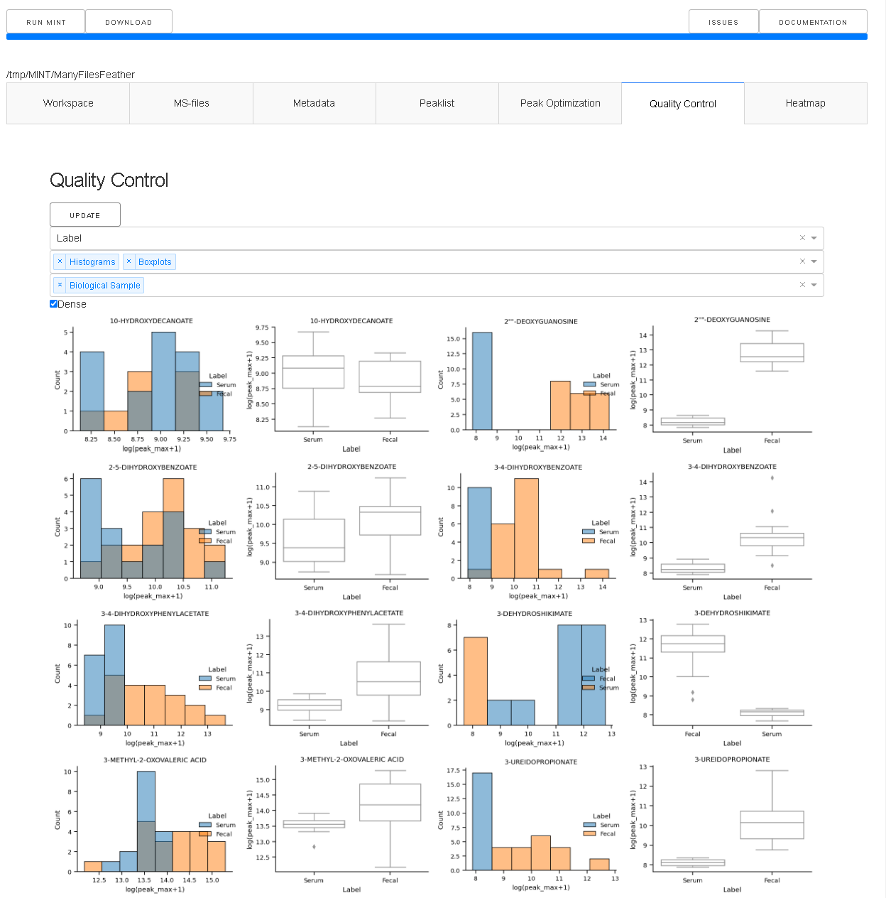

T