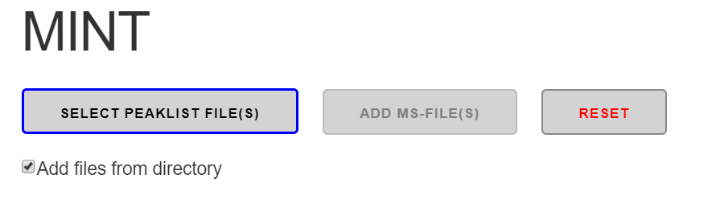
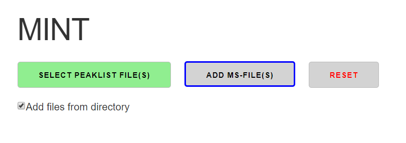
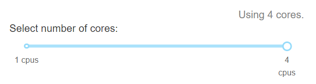
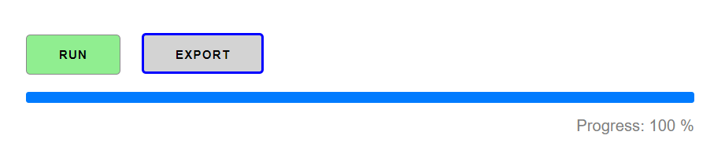
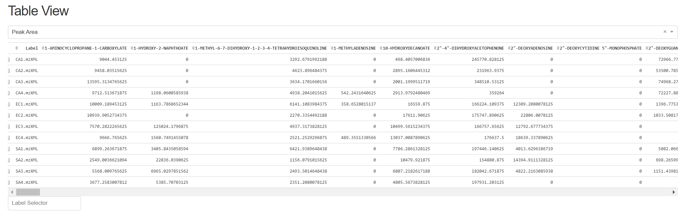
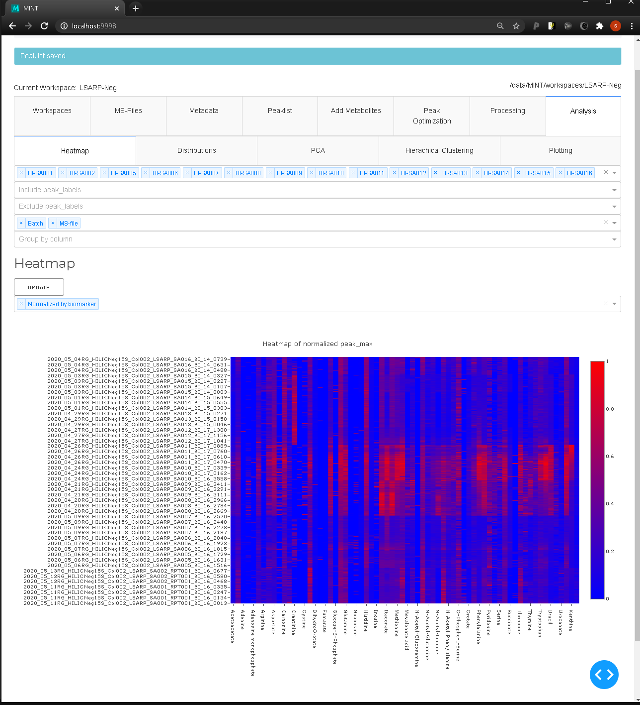

# Mint GUI
The app's frontend is build using [Plotly-Dash](https://plot.ly/dash/) and runs locally in a browser. Thought, the Python functions provided can be imported and used in any Python project independently. The GUI is under active development and might be changed in the future.

## Select Peaklist File(s)
A user defined peaklist can be selected and used with the `SELECT PEAKLIST FILE(S)` button. Peaklists are explained in more detail [here](index.md#peaklists).

## Add MS-Files
Individual files can be added to an in worklist using the `ADD FILE(S)` button. If the checkbox `Add files from directory` is checked, all files from a directory and its subdirectories are imported that end on `mzXML` or `mzML`. The box is checked by default. Note that files are always added to the worklist. The worklist can be cleared with the `RESET` button.

## Reset
Clicking the `RESET` button will delete current results and remove all selected files.

### Run
The number of cores used for MINT can be selected with the `Select number of cores` slider. The maximum number shown here depends on the computer on which MINT is running. The `RUN` button starts mint and a progress bar monitors the progress and can be used to estimate the remaining time.

### Export
Once generated Mint results can be exported by clicking on the `EXPORT` button. An Excel file is generated which is described in more detail [here](python.md#export).

# Interactive elements

## Interative Results Table

## Heatmap Tool

