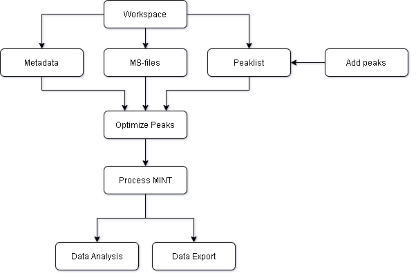

# MINT - Metabolomics Integrator
MINT is a post-processing tool for _liquid chromatography-mass spectrometry_ (LCMS) based _metabolomics_. 
Metabolomics is the study of all metabolites (small chemical compounds) in a biological sample e.g. from bacteria or a human blood sample. 
The metabolites can be used to define biomarkers used in medicine to find treatments for diseases or for the development of diagnostic tests 
or for the identification of pathogens such as methicillin resistant _Staphylococcus aureus_ (MRSA). 

 
_**Figure 1:**_ Flowchart of MINT processing workflow. 

## Quickstart
Check out the [Quickstart](quickstart.md) to jump right into it.

## What is it all about?
What problem is MINT solving? Check out the [background](background.md) section.

## How to use the Python API?
Go to the [Jupyter](jupyter.md) section.
