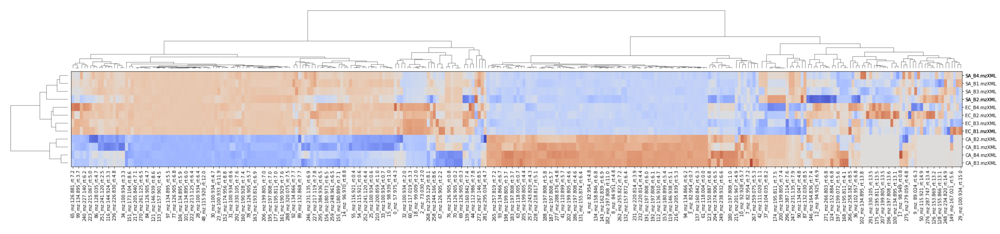

# Metabolomics Integrator (MINT)

MINT (Metabolomics Integrator) is a post-processing tool for liquid chromatography-mass spectrometry (LCMS) based metabolomics. 
Metabolomics is the study of all metabolites (small chemical compounds) in a biological sample e.g. from bacteria or a human blood sample. 
The metabolites can be used to define biomarkers used in medicine to find treatments for diseases or for the development of diagnostic tests 
or for the identification of pathogens such as methicillin resistant _Staphylococcus aureus_ (MRSA). 

A typical biological sample can contain thousands of metabolites with overlapping masses. If all metabolites would be analysed at the same time with the mass spectrometer, it would be impossible to separate the signal from different components as the same mass can originate from many different and distinct chemical structures. 

To reduce the complexity of the dataset, compounds are sorted with a chromatographic column and spread out over time, therefore adding a second dimension. That way various metabolites can be analysed successively over time. As the compounds have to pass through the column which delays certain compounds more than others according to some chemical properties e.g. their hydrophilicity. 

After the data has been collected and stored in a vendor specific format the data has to be analysed and deconvoluted. In other words, the data to be grouped by the originating or underlying metabolites in order to measure the specific amounts. This means to bring the unstructured data into a structured format where each column stands for one particular metabolite. The structured data can then be subjected to common data anayses such as dimensionality reduction, or clustering analysis.

The tool can be used for targeted analysis where the m/z-values (mass to charge ratios) and chromatographic retention times are known. Alternatively, MINT can be used in an untargeted approach where new biomarkers can be explored without prior knowledge.

MINT currently supports the open data formats mzML and mzXML. The main function is to extract and characterise measured intensities in a given m/z and retention time (RT) window. These windows can be provided in form of a [peaklist](peaklists.md) or created interactively in the [GUI](gui.md). With this setup large numbers of LCMS-files can be processed automatically, standardized and perfectly reproducible.

The tool can be used with a browser based graphical user interface (GUI) implemented as interactive dashboard with [Plotly-Dash](https://plot.ly/dash/). Alternatively, the `ms_mint` package can be imported as python library to be integrated in any regular Python code as part of a larger processing pipeline or interacively in the [Jupyter Notebook](jupyter.md).

