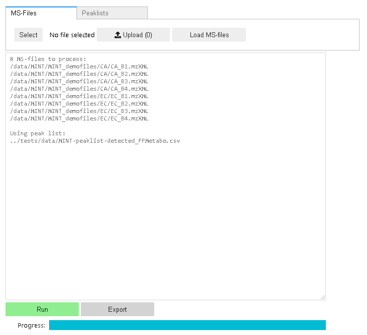

# Jupyter integration

## Interactive MINT
MINT can be used interactively in a `Jupyter Notebook` with a GUI that is based on IPython-Widgets or programmatically.

    from ms_mint.notebook import Mint
    mint = Mint(verbose=False)
    mint.show()

With the JupyterLab it is possible to customize the GUI to personal needs.

## Select MS-files

    from glob import glob
    mint.ms_files = glob('/path/to/files/*mzML')

## Select peaklist files

    mint.peaklist_files = '/path/to/peaklist/file/peaklist.csv'

## Optimize retention times

    mint.optimize_retention_times()

## Run MINT

    mint.run()

## Display results

That way the results will be readily available for further analysis.

    mint.results

