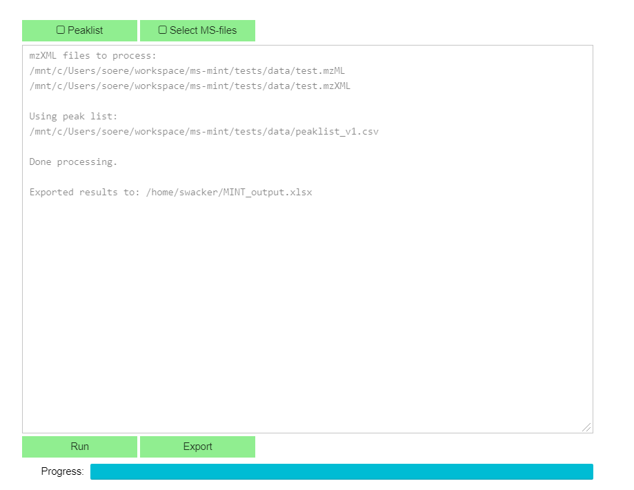

# Jupyter Integration

Mint can be integrated in an interactive `Jupyter Notebook` environment with a GUI that is based on IPython-Widgets.
The design follows the same principles as the [browser based GUI](gui.md)

    from ms_mint import Mint
    from ms_mint.JupyterGUI import JupyterGUI

    mint = Mint(verbose=False)
    gui = JupyterGUI(mint)
    gui.show()

That way the results will be readily available for further analysis and processing that is out of the scope of `MINT`.

    gui.results

