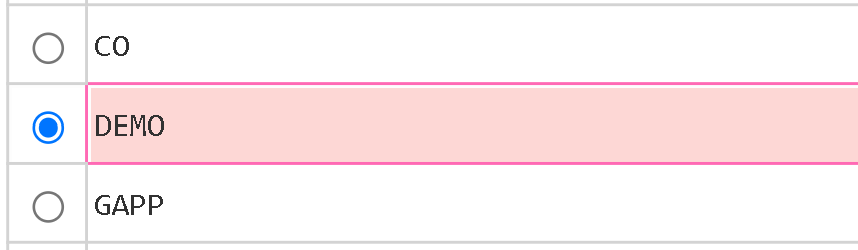
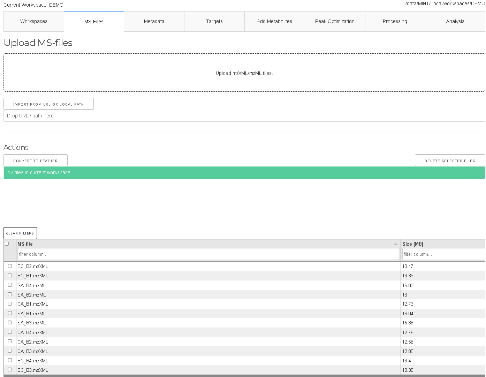
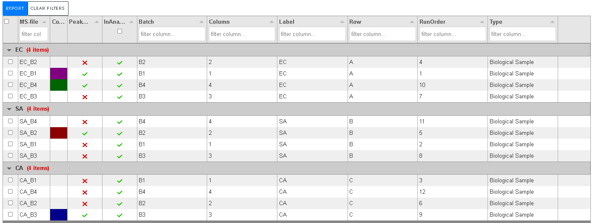
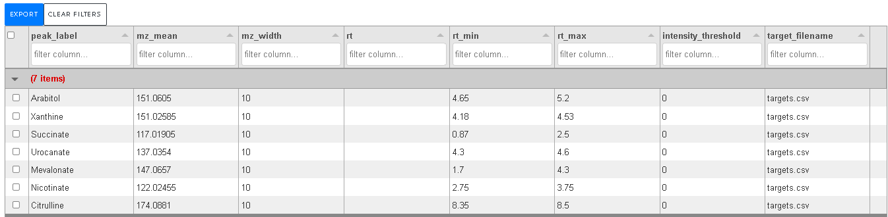
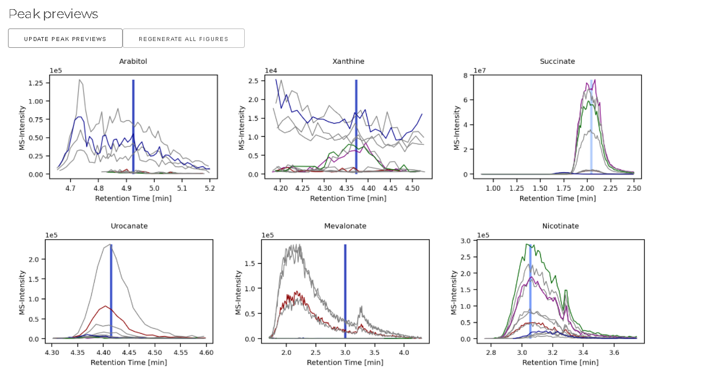
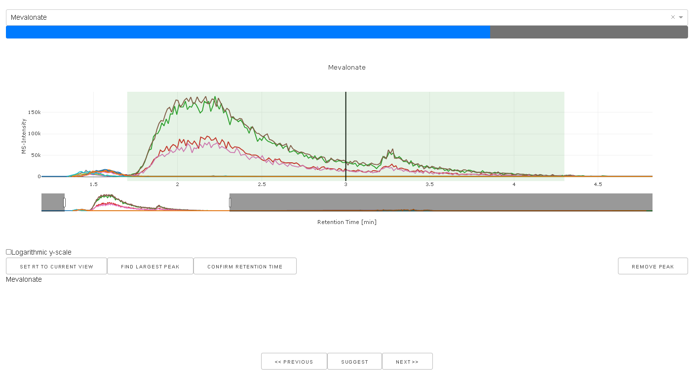
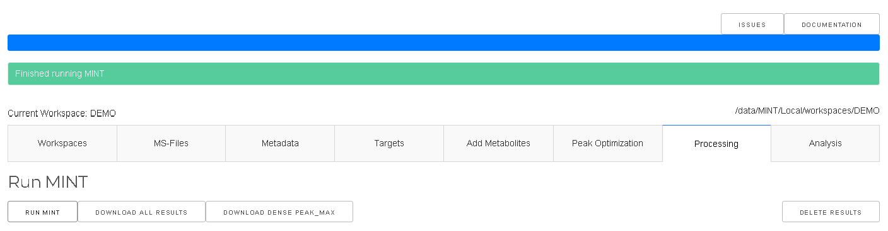
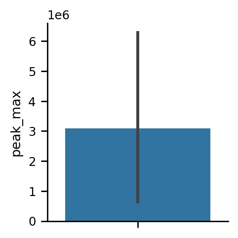
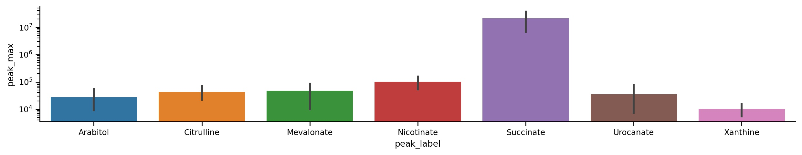
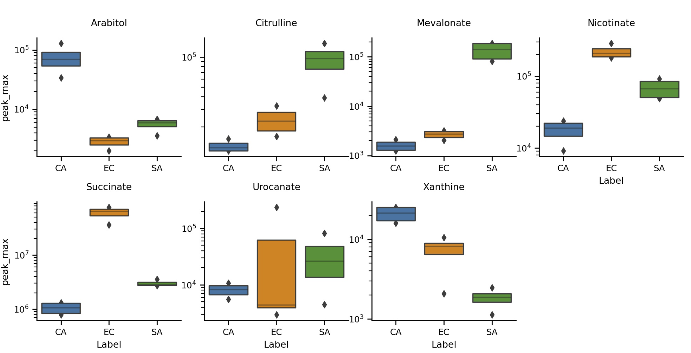

## Quickstart

A demo server is available [here](https://mint.resistancedb.org). Be mindful, you share the server with others.

Download the demo files from [Google Drive](https://drive.google.com/drive/folders/1giAiAJmtOWKN124S0iK9SeiZrFqJjqhQ?usp=sharing) and extract the archive.

You will find two `csv` files and 12 `mzXML` and/or `mzML` files. 

- A folder with 12 mass-spectrometry (MS) files from microbial samples. We have four files for each _Staphylococcus aureus_ (SA), _Escherichia coli_ (EC), and _Candida albicans_ (CA).
Each file belongs to one of four batches (B1-B4). 
- `MINT-metadata.csv` contains this information in tabular format. Setting up the metadata for your project is essential. 
- `MINT-targets.csv` contains the extraction lists. The identification of the metabolites has been done before, so we know where the metabolites appear in the MS data.

## 1. Open the MINT application and create a new workspace named DEMO.

At `workspaces` click on `CREATE WORKSPACE`. Type `DEMO` into the text field and click on `CREATE`.

## 2. Make sure the DEMO workspace is activated, indicated by a blue bullet in the workspace table.

## 3. Switch to `MS-Files` and upload the 12 MS files. 

Wait until all files are uploaded.

## 4. Switch to `Metadata` and upload `MINT-metadata.csv`.

This file contains information about your samples. Setting up metadata is important and needs to be done with care.
Your downstream analysis will benefit greatly from a good metadata table.

- `PeakOpt` if True these files will be used in the peak optimization tab.
- `Label` should be used to indicate the group of the sampe. E.g. treatment group vs control group.
- `Batch` is the batch ID, for example the plate if samples come from multiple plates.
- `Type` indicates the type for the sample. By default evertying is called `Biological Sample`, other meaningful labels are `Standard Sample` or `Quality Control`.
- `Row` and `Column` indicate the location of the sample on the plate e.g. 1-12 and A-H for a 96-well plate.
- `RunOrder` can contain the order 1-N in which the samples were processed.
-  Add more columns if you need. You can download the file, add new columns with Excel, and upload the table again. 
-  Use the `action` to set multiple cell values at once. 

## 5. Switch to `Targets` and upload `MINT-targets.csv`.

This is the data extraction protocol. This determines what data is extracted from the files. The same protocol is applied to all files. No fitting or peak optimization is done. 
MINT therefore requires a very stable chromatographic column and stable retention times for all files in a workspace. 

## 6. Switch to `Peak Optimization`
Switch the `File selection` to `Use all files`. Normally, especially for large datasets, you should select a small representative set of samples. The peak optimization takes longer the more files are used for it and the more targets are defined. 'Click on `UPDATE PEAK PREVIEWS`. 

- here you can see the shapes of the extracted peaks.
- optimize the retention time with the interactive tool.
- you can click on the image to load the data into the interactive tool or use the dropdown menu.
- highlight the prefered region (highlighted in green) and click on `SET RT TO CURRENT VIEW` to update the retention time window.
- the horizontal bar indicates how far away the selected window is from the `rt` reference value in the `Targets`.

- if you are happy with the peak shapes you can proceed to `Processing`.

## 6. Switch to `Processing` and start the data extraction with `Run MINT`

The extraction process is done when you get a green notification `Finished running MINT`.
Now, you can download the results in long-format or the dense peak_max values. 
The tidy format contains all results, while the `DENSE PEAK_MAX` only contians the `peak_max` values as a matrix. 

## 7. Switch to `Analysis`.

Once the results are generated the 'Heatmap` tab will show an interactive heatmap.
You can change the size of the heatmap by changing your browser window and `UPDATE` the plot.
The heatmap shows the `peak_max` values. The dropdown menu provides some options.

## 8. Switch to `Analysis/Plotting`

The plotting tool is very powerful, but requires some practise. It is a wrapper of the powerful seaborn API. 
Let's create a few simple visualizations.

And click on `Update`. A very simple bar-graph is shown, and we will gradually make it more complex. 
This simple bar graph shows the average `peak_max` value across the whole dataset for all targets. 

### a) select `peak_label` for the `X` axis.
### b) set aspect-ratio to 5.
### c) select `Logarithmic y-scale` in the dropdown options.
### d) click on `UPDATE`.

### e) set figure height to `1.5` and aspect ratio to `2`.
### e) set `Column` to `Label`.
### f) set `Row` to `Batch`.

This way you can look at the whole dataset at once, sliced by `Batch` and `Label`

## Exercise: Try to create the following plot:

